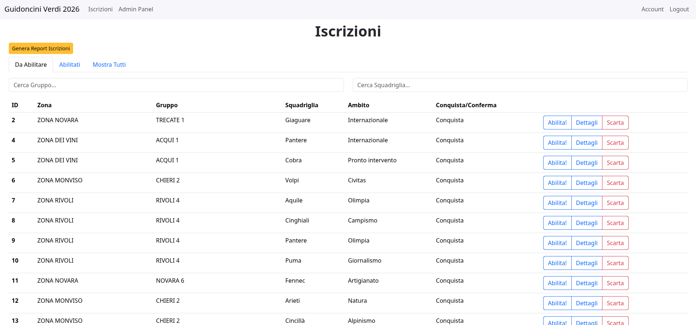

# Gestionale Guidoncini Verdi Piemonte

Gestionale utilizzato per validare le iscrizioni al percorso Guidoncini Verdi di [AGESCI Piemonte](https://piemonte.agesci.it/).

La validazione iscrizioni genera delle richieste alle API di [guidonciniverdi.it](https://guidonciniverdi.it/) per la creazione dell'account utente e delle pagine del Diario di Bordo.

Il gestionale si occupa inoltre dell'invio di mai a ragazzi e capi.

Generazione file excel delle iscrizioni per tutti i livelli di utenza (nei limiti della stessa).

### Scelte implementative

Gestione del backend tramite Flask ([Documentazione qui](https://flask.palletsprojects.com/)).

Come database è stato scelto SQLite ([Documentazione qui](https://www.sqlite.org/)) per la sua leggerezza e la facilità di esportare i dati in caso di cambio hosting, la connessione con il database è fatta tramite SQLAlchemy ([Documentazione qui](https://www.sqlalchemy.org/)).

### Livelli di utente

Sono presenti quattro livelli di utente.

| Livello       | Permessi                                                                                                                                                                                                                                                                                                                                     |
| ------------- | -------------------------------------------------------------------------------------------------------------------------------------------------------------------------------------------------------------------------------------------------------------------------------------------------------------------------------------------- |
| Admin         | Può fare tutto, inoltre vede i dati grezzi di ogni risposta                                                                                                                                                                                                                                                                                  |
| IABR          | Può vedere e autorizzare le squadriglie di tutta la regione, eliminare eventuali risposte al form erronee, modificare dettagli delle iscrizioni, avviare il percorso a inizio anno e concludere l'anno eliminando tutti gli account wordpress (maggiori dettagli quando implementato) e mandare mail a squadriglie iscritte e/o capi reparto |
| Pattuglia E/G | Può vedere e autorizzare le squadriglie di tutta la regione                                                                                                                                                                                                                                                                                  |
| IABZ          | Può vedere e autorizzare le squadriglie della sua zona                                                                                                                                                                                                                                                                                       |

### Future

- Reset password degli utenti wordpress

- Possibilità di creare pagine extra su wordpress

- Sistema di reset a fine anno
