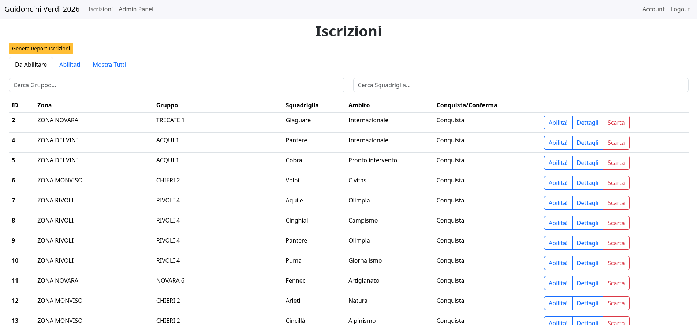

# Gestionale Guidoncini Verdi


Gestionale utilizzato per validare le iscrizioni al percorso Guidoncini Verdi di:

[AGESCI Piemonte](https://piemonte.agesci.it/)

[AGESCI Valle d'Aosta](https://valdaosta.agesci.it/)

[AGESCI Puglia](https://puglia.agesci.it/)

[AGESCI Sardegna](https://sardegna.agesci.it/)

La validazione iscrizioni genera delle richieste alle API di [guidonciniverdi.it](https://guidonciniverdi.it/) per la creazione dell'account utente e delle pagine del Diario di Bordo.



Il gestionale si occupa inoltre dell'invio di mail a ragazzi e capi.

Generazione file excel delle iscrizioni per tutti i livelli di utenza (nei limiti della stessa).

### Deploy
Docker compose: 
```yaml
services:
  gestionale:
    image: ghcr.io/egit-guidoncini-verdi/guidonciniverdi-gestionale:latest
    restart: unless-stopped
    environment:
      DB_TYPE: mariadb
      DB_USER: app_user
      DB_PASSWORD: app_password
      DB_HOST: db
      DB_PORT: 3306
      DB_NAME: app_db
      SECRET_KEY: secret_key
    depends_on:
      db:
        condition: service_healthy

  worker-mail:
    image: ghcr.io/egit-guidoncini-verdi/guidonciniverdi-worker-mail:latest
    restart: unless-stopped
    environment:
      DB_TYPE: mariadb
      DB_USER: app_user
      DB_PASSWORD: app_password
      DB_HOST: db
      DB_PORT: 3306
      DB_NAME: app_db
      SECRET_KEY: secret_key
    depends_on:
      - gestionale

  worker-notifiche:
    image: ghcr.io/egit-guidoncini-verdi/guidonciniverdi-worker-notifiche:latest
    restart: unless-stopped
    environment:
      URL_NOTIFICHE: url_notifiche
      API_KEY: api_key
    depends_on:
      - gestionale

  db:
    image: mariadb:11.4
    container_name: mariadb
    restart: unless-stopped
    environment:
      MARIADB_ROOT_PASSWORD: rootpassword
      MARIADB_DATABASE: app_db
      MARIADB_USER: app_user
      MARIADB_PASSWORD: app_password
      TZ: Europe/Rome
    volumes:
      - mariadb-data:/var/lib/mysql
    healthcheck:
      test: ["CMD", "mariadb-admin", "ping", "-h", "localhost", "-uroot", "-prootpassword"]
      interval: 5s
      timeout: 3s
      retries: 5

  smtp:
    image: boky/postfix
    container_name: smtp_relay
    environment:
      RELAYHOST: "[smtp.gmail.com]:587"
      RELAYHOST_USERNAME: your@gmail.com
      RELAYHOST_PASSWORD: yourpassword
    depends_on:
      - worker-mail

  nginx:
    image: nginx:alpine
    restart: unless-stopped
    ports:
      - "5000:80"
    volumes:
      - nginx-data:/etc/nginx
    depends_on:
      - gestionale

volumes:
  mariadb-data:
  nginx-data:
```

### Scelte implementative

Gestione del backend tramite Flask ([Documentazione qui](https://flask.palletsprojects.com/)).

Come database è stato scelto SQLite ([Documentazione qui](https://www.sqlite.org/)) per la sua leggerezza e la facilità di esportare i dati in caso di cambio hosting, la connessione con il database è fatta tramite SQLAlchemy ([Documentazione qui](https://www.sqlalchemy.org/)).

### Livelli di utente

Sono presenti quattro livelli di utente.

| Livello       | Permessi                                                                                                                                                                                                                                                                                                                                     |
| ------------- | -------------------------------------------------------------------------------------------------------------------------------------------------------------------------------------------------------------------------------------------------------------------------------------------------------------------------------------------- |
| Admin         | Può fare tutto, inoltre vede i dati grezzi di ogni risposta                                                                                                                                                                                                                                                                                  |
| IABR          | Può vedere e autorizzare le squadriglie di tutta la regione, eliminare eventuali risposte al form erronee, modificare dettagli delle iscrizioni, avviare il percorso a inizio anno e concludere l'anno eliminando tutti gli account wordpress (maggiori dettagli quando implementato) e mandare mail a squadriglie iscritte e/o capi reparto |
| Pattuglia E/G | Può vedere e autorizzare le squadriglie di tutta la regione                                                                                                                                                                                                                                                                                  |
| IABZ          | Può vedere e autorizzare le squadriglie della sua zona                                                                                                                                                                                                                                                                                       |

### Future

- Reset password degli utenti wordpress

- Possibilità di creare pagine extra su wordpress

- Sistema di reset a fine anno
